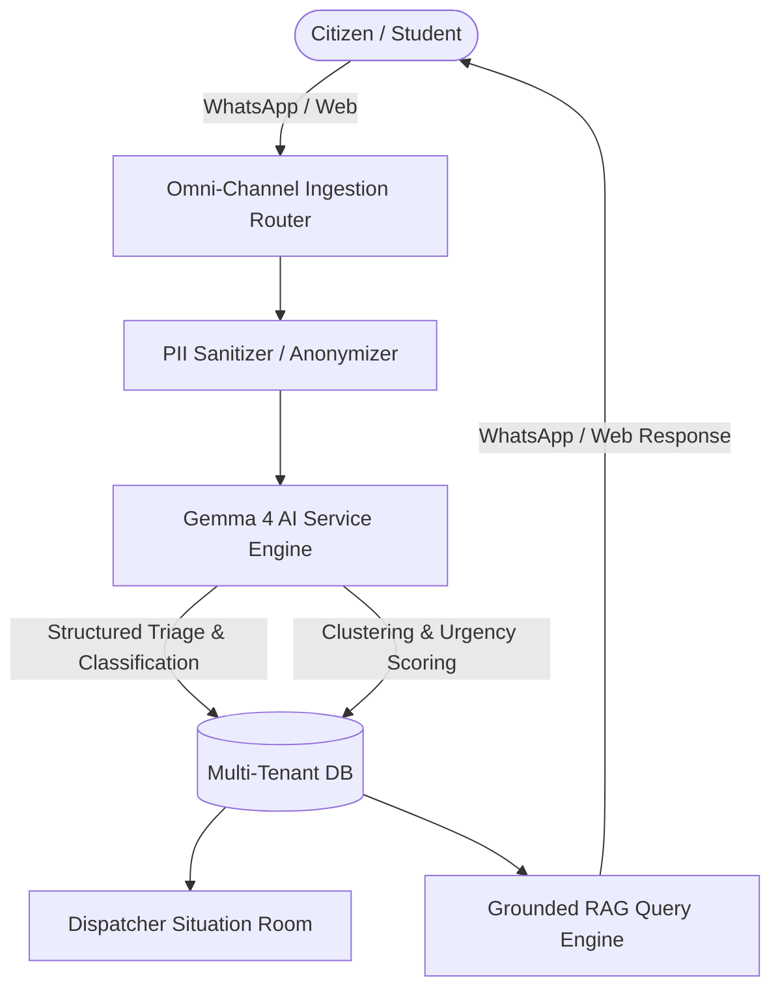

# 🛡️ SENTRY — AI Community Safety & Intelligence Platform

> **"Sentry is an AI-powered community safety assistant that helps underserved communities report, classify, prioritize, and respond to emergencies through WhatsApp using Gemma."**

Sentry is a multi-tenant community intelligence platform powered by **Gemma 4**. It ingests unstructured incident reports from multiple sources (WhatsApp, Web), automatically anonymizes PII, classifies incidents, computes real-time urgency/confidence scores, clusters similar reports, and provides grounded RAG intelligence for dispatchers.

---

## 🎯 UN Sustainable Development Goals (SDG) Alignment

Sentry is explicitly built to advance key United Nations SDGs:

- **SDG 11: Sustainable Cities and Communities**
  * *Impact:* Empowers underserved campus communities and local towns with accessible, zero-friction incident reporting over WhatsApp to maintain local safety and operational resilience.
- **SDG 3: Good Health and Well-being**
  * *Impact:* Accelerates emergency dispatch response times during critical medical or safety hazards by auto-triaging urgency scores.
- **SDG 16: Peace, Justice, and Strong Institutions**
  * *Impact:* Fosters transparent, accountable interaction between citizens and campus/local authorities with automated PII redaction and audit logs.

---

## 🧠 Why Gemma 4?

- **Open Weights & Local Deployment:** Can be self-hosted locally (via Ollama) or on edge nodes in low-connectivity/offline zones.
- **Privacy & PII Protection:** Essential for handling sensitive community safety reports without exposing private user data.
- **Cost Efficiency:** High performance at lower inference cost compared to proprietary closed models.
- **Structured JSON Synthesis:** Gemma 4 provides reliable structured output generation for real-time triage and RAG document grounding.

---

## 🏗️ System Architecture & Data Flow



---

## 🚀 Key Features

1. **Modular Backend Architecture:** Built on FastAPI with strict separation between API routers, services, and core settings.
2. **Multi-Tenant Platform:** Built to support multiple campus/municipal sectors (`kwasu_main`, `malete_town`, `ilorin_central`).
3. **Omni-Channel WhatsApp Node:** Meta WhatsApp Cloud API & Twilio integration.
4. **Grounded RAG Search:** Instant Q&A over live community reports with zero hallucination guarantee.
5. **Dispatcher Situation Briefs:** Auto-generated executive summaries synthesizing active incident clusters.

---

## 🛠️ Local Setup

1. Clone the repository.
2. Install dependencies:
   ```bash
   pip install -r requirements.txt
   ```
3. Copy `.env.example` to `.env` and configure:
   ```env
   GEMINI_API_KEY=your_gemini_api_key
   ADMIN_PASSCODE=sentry_admin_passcode
   ```
4. Run the server:
   ```bash
   uvicorn app:app --reload
   ```

---

## 🧪 Testing & CI/CD

Run automated tests locally:
```bash
pytest tests/
```
GitHub Actions CI/CD automatically runs test suites on every pull request.
